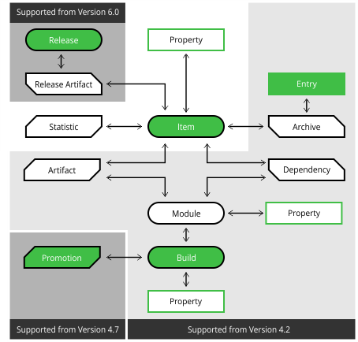

# jfrog-aql

#### 1. 介绍
利用 JFrog aql 完成多种搜索需求场景

#### 2. 软件架构


#### 3. AQL 调用
```
// API 方式
curl -H X-JFrog-Art-Api:${API_KEY} -X POST "${artURL}/artifactory/api/search/aql" -T artifact.aql

// JFrog CLI 方式
jf rt curl -XPOST  /api/search/aql -T artifact.aql
```

#### 4. AQL
- artifact.aql  
查询某制品库的所有制品

- recycle.aql  
清理 6个月前创建的没有下载过的 jar 包

- class.aql  
查找包含 App.class 的 jar 包类型制品

- license.aql
查找是 apache license 的 war 包制品

- release.aql  
查找构建状态是 release 的 war 包制品

- quality.aql  
查找构建达到某些质量关卡的制品

- properties.aql  
根据多个属性查询制品

#### 5. spec
- download.spec
根据 aql 查找符合条件的数据，然后可以通过执行 jfrog cli --spec 命令执行

